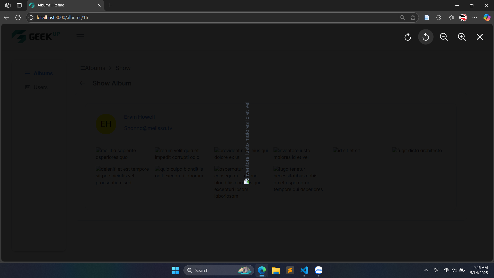

This is a [Next.js](https://nextjs.org/) project bootstrapped with [`create-next-app`](https://github.com/vercel/next.js/tree/canary/packages/create-next-app).

## 🚀 Getting Started
First, clone this repository:
```bash
git clone https://github.com/nguyentienphat2904/frontend-technical-assessment.git
cd frontend-technical-assessment
```

Then, install needed packages:
```bash
npm install
# or 
yarn
```

After that, create _.env_ file with content:
```bash
NEXT_PUBLIC_BACKEND_LOGIN_ENDPOINT=https://jsonplaceholder.typicode.com
```

Finaly, run the development server:

```bash
npm run dev
# or
yarn dev
# or
pnpm dev
# or
bun dev
```

Open [http://localhost:3000](http://localhost:3000) with your browser to see the result.

## 🛠️ Technologies

| Technology       | Description & Reason for Use                                                                                                 |
| ---------------- | ---------------------------------------------------------------------------------------------------------------------------- |
| **Next.js**      | A powerful React framework that supports server-side rendering and SEO optimization. Ideal for building modern web apps.     |
| **React.js**     | A flexible JavaScript library for building user interfaces with reusable components. Well-documented with a large community. |
| **PrimeReact**   | A rich UI component library that speeds up development with ready-made, customizable components.                             |
| **Tailwind CSS** | A utility-first CSS framework for rapidly building custom designs. Works great with component-based development.             |
| **SCSS (Sass)**  | A CSS preprocessor that helps write cleaner, modular CSS using variables, mixins, and nesting.                               |
| **CSS**          | Used for simple styling needs or quick overrides, working alongside Tailwind and SCSS for flexibility.                       |

## 📈 Results


<p align="center"><i>Pic1. Albums page.</i></p>


<p align="center"><i>Pic2. Pagination for albums, using parameters from the URL.</i></p>


<p align="center"><i>Pic3. Show album.</i></p>


<p align="center"><i>Pic4. Preview photo in album.</i></p>


<p align="center"><i>Pic5. Users page.</i></p>


<p align="center"><i>Pic6. Mail to user.</i></p>


<p align="center"><i>Pic6. Show user.</i></p>

### 📩 Contact Information
If you have any questions or feedback, feel free to reach out to me:

Email: phat.nguyen221252729@hcmut.edu.vn

I’ll be happy to help!